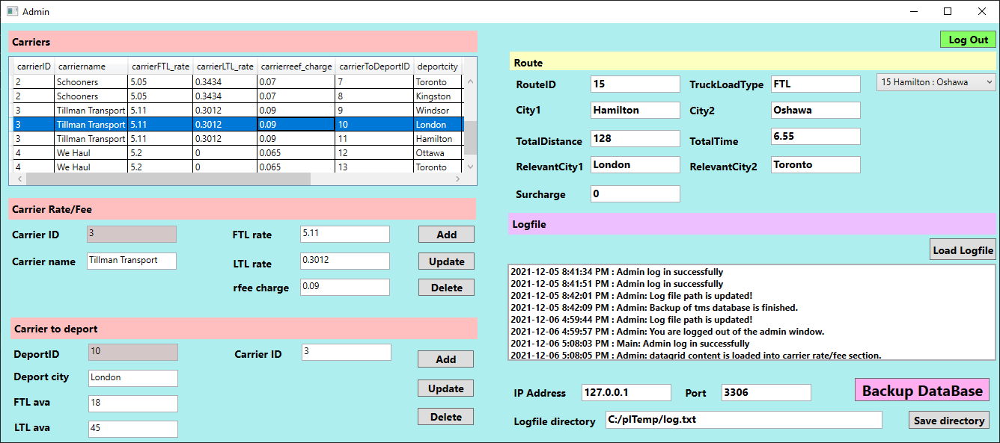

# Transportation-Management-System-C-WPF-XAML

# Log In 
  - connects to MySql database for log in credentials
  - used regular expression for validation

# Admin

  - ability to operate CRUD for carrier and route tables in the database 
  - ability to view and load logfile
  - ability to backup the entire current database to desinated directory

# Buyer

  - ability to review contracts and clients
  - ability to create new orders
  - ability to accept/reject clients
  - ability to select relevant cities for carrier to freight calculation 
  - ability to view order status 
  - ability to generate invoice

# Planner

